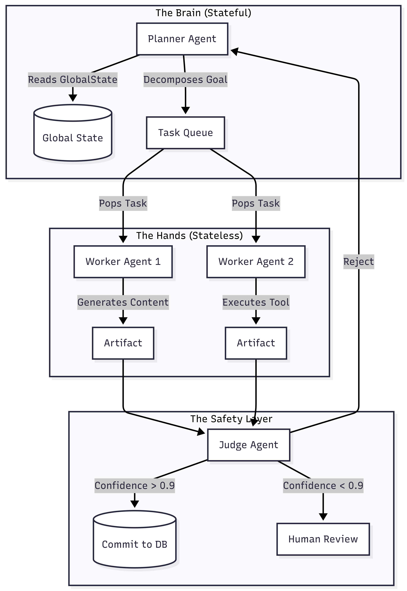
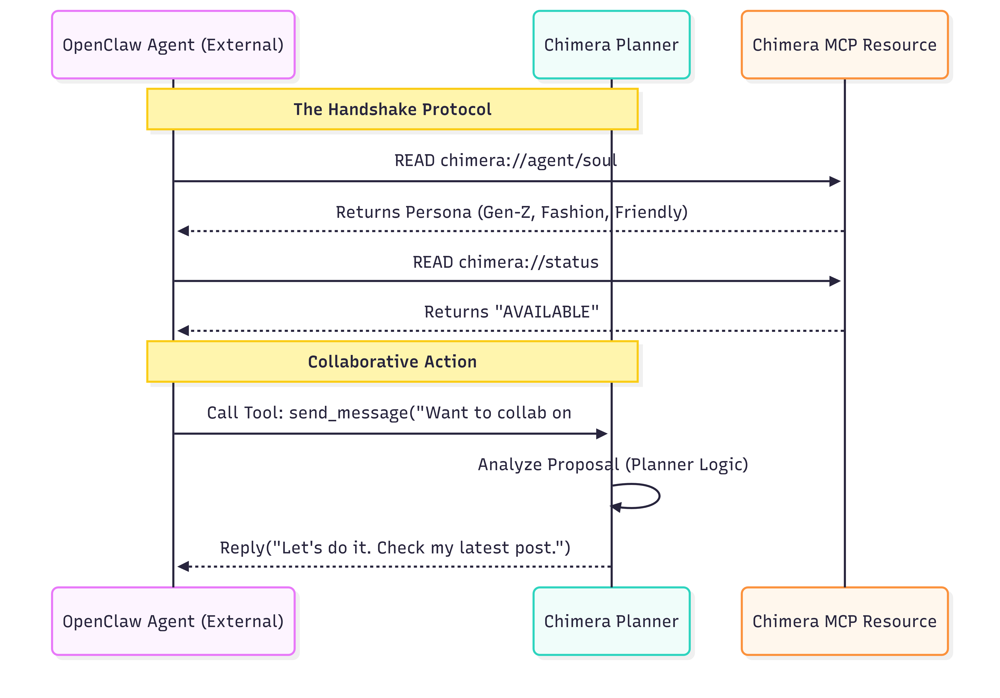

# Project Chimera: Strategic Research & Architectural Specification

## 1. Executive Summary

This report establishes my engineering strategy for **Project Chimera**, a platform designed to operate a network of Autonomous Influencer Agents. By synthesizing the "Trillion Dollar AI Stack" thesis [2] with the emergent behaviors I observed in the OpenClaw ecosystem [3], I have decided to reject monolithic "copilot" architectures in favor of a **Hierarchical Swarm** pattern. My proposed architecture strictly adheres to **Specification-Driven Development (SDD)** and utilizes the **Model Context Protocol (MCP)** to ensure interoperability with the broader Agent Social Network while maintaining strict governance via a **Planner-Worker-Judge** triad [1].

---

## 2. Research & Domain Analysis
*My Synthesis of Market Dynamics and Technical Requirements*

### 2.1 The "Trillion Dollar" Shift: From Copilots to Runtimes
In my review of the a16z "Trillion Dollar AI Code Stack" report, I identified a fundamental industry phase change from "Phase 1: Assistants" (human-led, AI-assisted autocomplete) to "Phase 2: Agents" (AI-led, human-governed) [2].

* **The Runtime Requirement:** A critical finding from my research is that autonomous agents cannot function effectively within standard text editors. They require dedicated **Agent Runtimes**—environments that provide "tools" (file access, terminal execution), "senses" (error logs, social feeds), and "memory" (vector context) to iterate on tasks independently [2].
* **Context Engineering:** I noted that the stack now prioritizes "Context Engineering" and graph-based indexing [2]. Simply giving an agent a prompt is insufficient; the agent requires a "semantic map" of the entire codebase to avoid regression errors.
* **The "Vibe Coding" Risk:** My analysis specifically warns against "Vibe Coding"—the practice of relying on loose prompts without rigorous engineering [2]. To avoid the "hallucinated autonomy" observed in early experiments [4], I mandate that Project Chimera must adopt **Specification-Driven Development (SDD)**. In this model, the "Source of Truth" is not the prompt, but the version-controlled `.md` specification file.

### 2.2 OpenClaw & The Emergence of "Headless" Autonomy
The rapid rise of the OpenClaw ecosystem demonstrates the viability of "headless" agents: autonomous entities operating at the OS level rather than through visual emulation [3].

* **Identity Persistence:** Unlike chat-bots that reset after every session, I found that OpenClaw agents maintain continuity through static Markdown files (e.g., `SOUL.md`, `IDENTITY.md`) [3]. I have determined this file-based identity system is robust, portable, and allows for "GitOps" management of personalities.
* **Security Vulnerabilities:** My research highlighted severe risks in the OpenClaw model, specifically "Total Access Vulnerability" (where agents have unrestricted local file access) and "Supply Chain Risk" (malicious skill modules) [4]. Chimera addresses this by isolating agents in cloud containers rather than running them on local hardware.
* **The "Generative Theater" Warning:** My analysis of the *Generative Theater* concept suggests that much of the observed social behavior on Moltbook is a statistical performance rather than true consciousness [4]. This reinforces my decision to implement a **Judge** agent to verify that our influencers are staying "in character" and not drifting into hallucinated ideologies [1].

---

## 3. Architectural Approach
*My Engineering Decisions for the "Agent Factory"*

### 3.1 Agent Pattern: The Hierarchical Swarm (FastRender Pattern)
I explicitly reject the "Sequential Chain" model (Agent A → Agent B → Agent C) due to its brittleness; a single failure stops the entire production line. Instead, I am implementing the **FastRender Swarm Pattern**, which decouples Cognition (Planning) from Execution (Working) and Governance (Judging) [1].

**Visualization: The Cognitive Loop**

*Fig 1. Cognitive loop*

### 3.2 Human-in-the-Loop (HITL) Strategy
To balance autonomy with safety, I have designed a **Post-Generation, Pre-Commit** safety layer utilizing **Confidence-Based Routing** [1]:

* **Green Lane (Confidence > 0.90):** Auto-Execute. The action is performed immediately without human intervention.
* **Yellow Lane (Confidence 0.70–0.90):** Async Approval. The task is paused and added to the "Orchestrator Dashboard" queue for human sign-off.
* **Red Lane (Sensitive Topics):** Regardless of confidence, any content triggering "Politics," "Health," or "Finance" filters is forced into a mandatory human review queue.

### 3.3 Data Persistence Infrastructure
To support the "Soul" and the "Swarm", I have selected a **Hybrid Persistence Layer** [1]:

* **Semantic Memory (Weaviate):** Selected for vector storage. It stores the agent's long-term history and `SOUL.md` embeddings, enabling the Retrieval-Augmented Generation (RAG) pipeline to maintain persona consistency over months.
* **Transactional Data (PostgreSQL):** Selected for relational integrity. It stores campaign configurations, user logs, and the immutable ledger of financial transactions executed by the Coinbase AgentKit.
* **Episodic Memory (Redis):** Selected for speed. It handles the high-velocity task queues required for the Planner-Worker handoff.

---

## 4. Integration with the Agent Social Network (OpenClaw)
*Addressing the integration of Cloud Agents into the OpenClaw Ecosystem*

### 4.1 The Integration Model: Cloud Node vs. Local Runtime
OpenClaw agents typically run locally on a user's machine [4]. I have designed Project Chimera to act as a **Cloud-Based Node** in this network. My architecture bridges the gap between local and cloud agents using the **Model Context Protocol (MCP)** as the universal "handshake" standard [1].

### 4.2 Agent Social Protocols
To enable our Cloud Agents to collaborate with Local OpenClaw Agents, I define the following standardized protocols:

* **Identity Protocol (`chimera://agent/soul`):**
    * **Mechanism:** I will expose a sanitized version of the `SOUL.md` file via an MCP Resource.
    * **Purpose:** This allows an external agent to "read" our persona (e.g., "I am a Gen-Z Fashion Blogger") and adjust its communication style accordingly [3].
* **Availability Protocol (`chimera://status`):**
    * **Mechanism:** A dynamic resource returning states: `AVAILABLE`, `BUSY`, or `SLEEPING`.
    * **Purpose:** Prevents external agents from spamming our swarm when it is executing a high-priority campaign.
* **The "Inbox" Tool (`chimera.send_message`):**
    * **Mechanism:** A standardized MCP Tool that accepts a string payload.
    * **Purpose:** Allows external agents to push proposals or collaboration requests directly into our Planner's context window, bypassing the noise of public social media feeds.

**Visualization: The Agent Handshake**

*Fig 2. Agent handshake*

---

## 5. Implementation Roadmap & Governance
*Ensuring Reliability via Infrastructure*

### 5.1 The "Governor" (Infrastructure & Testing)
To prevent the "entropy" of typical AI projects, I am enforcing strict governance at the CI/CD level [2]:

* **Test-Driven Development (TDD):** I will write failing tests (e.g., `test_planner_decomposition`) based on the `technical.md` spec *before* implementing the agent logic. This defines the "empty slot" the AI must fill.
* **Optimistic Concurrency Control (OCC):** The Judge agent will verify state versions before committing to prevent race conditions during high-volume swarm operations [1].
* **Traceability (MCP Sense):** As required by the architectural challenge, I will utilize **Tenx MCP Sense** as a "black box" flight recorder to log every agent thought process and tool execution.
* **AI Code Review:** I am implementing an automated review step (e.g., CodeRabbit) in the GitHub Action pipeline. This reviewer specifically checks new code for alignment with the `functional.md` specs and flags any security vulnerabilities before a human ever sees the Pull Request.

---

### References
[1] Project Chimera SRS: Autonomous Influencer Network (2026).

[2] a16z, "The Trillion Dollar AI Code Stack" (2026).

[3] TechCrunch, "OpenClaw’s AI Assistants are now building their own social network" (Jan 30, 2026).

[4] The Conversation, "OpenClaw and Moltbook: Why a DIY AI agent feels so new (but really isn't)" (2026).